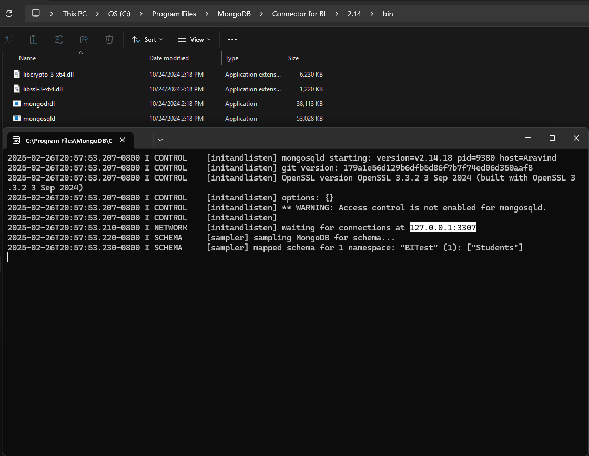
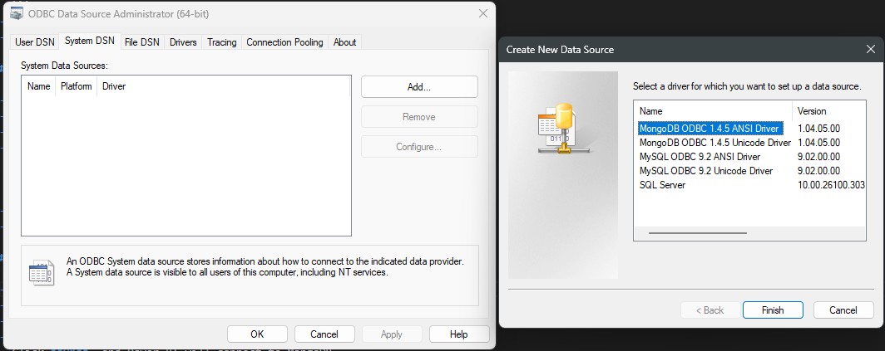
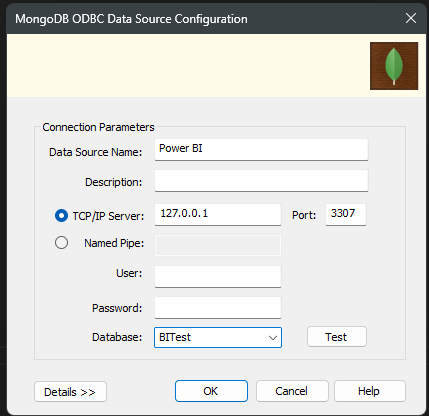
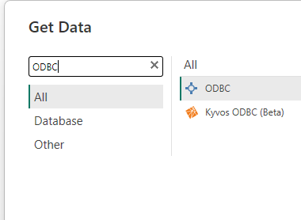
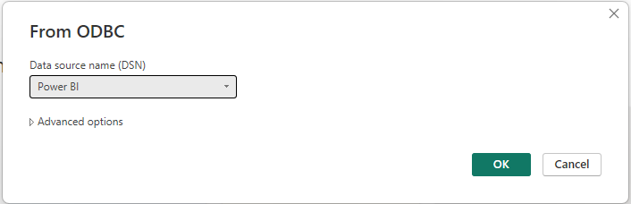
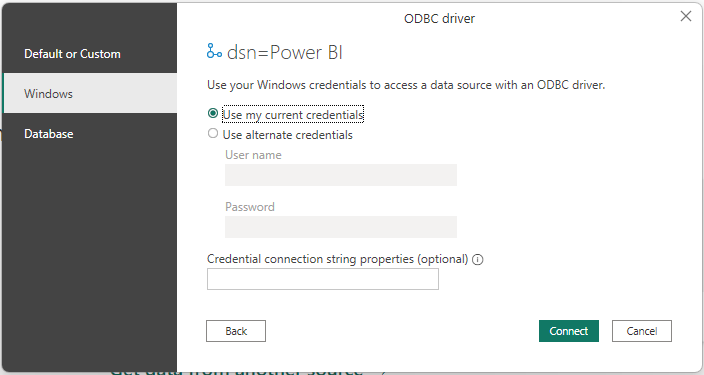
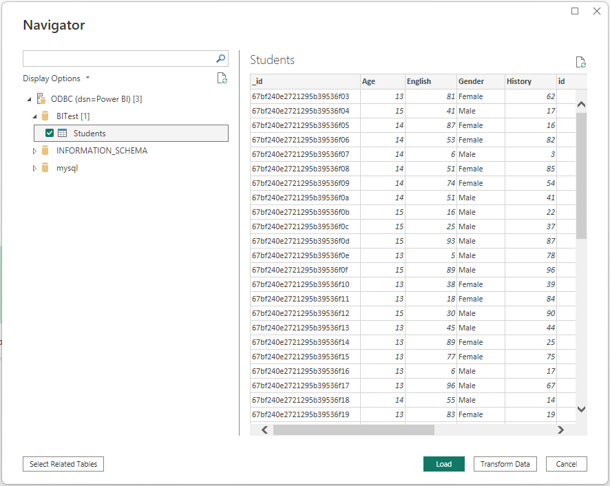
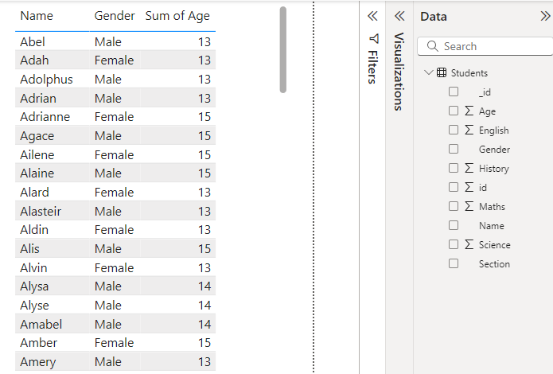
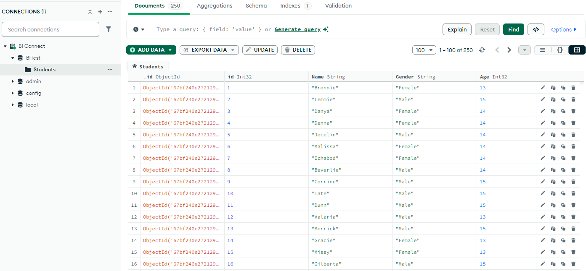

# PowerBI-MongoDB-Connection
Power BI MongoDB Connection – A step-by-step guide on connecting Power BI to a MongoDB database. 🚀 

## Prerequisites  

- **MongoDB** installed  
- **Power BI** installed  
- **MongoDB BI Connector** installed – [Download Here](https://www.mongodb.com/try/download/bi-connector)  
- **MongoDB ODBC Connector** installed – [Download Here](https://github.com/mongodb/mongo-bi-connector-odbc-driver/releases/)  

## Steps to Connect Power BI to MongoDB  

### 1. Run the MongoDB BI Connector (`mongosqld`)  

- Open **Command Prompt** and run:  
  ```shell
  "C:\Program Files\MongoDB\Connector for BI\2.14\bin\mongosqld.exe"
  ```  
- If you installed it in a different directory, update the path accordingly.  
- The server and port will be displayed in the terminal.





### 2. Configure ODBC Data Source  

- Click **Windows Key**, search for **ODBC Data Sources**, and open it.  
- Navigate to the **System DSN** tab and click **Add**.  
- Select **MongoDB ODBC ANSI Driver** and click **Finish**.  
- Fill in the following details:  
  - **Data Source Name (DSN)**: Choose any name.  
  - **Description**: (Optional)  
  - **Server & Port**: Use the values shown in the `mongosqld` terminal.  
- Click **Test Connection** → Ensure it shows **"Connection Successful"**.  
- Select the database and click **OK**. 








### 3. Connect Power BI to MongoDB  

- Open **Power BI Desktop**.  
- Click **Get Data** → Select **Other Sources** → Search for **ODBC**.  
- Click **ODBC** and then **Connect**.  
- Choose the **Data Source Name (DSN)** you created earlier.  
- Click **OK**, and **CHOOSE WINDOWS AND DON'T CHANGE ANYTHING IN THIS WINDOW AND CLICK CONNECT**. Power BI will connect to MongoDB.  
- You should now see your database and collections in Power BI.














## Confirmation  

 
    

 
    


## Troubleshooting Tips  

- Ensure `mongosqld` is running before connecting.  
- Check **firewall settings** if connection issues occur.  
- Use the correct **ODBC driver version** that matches your MongoDB setup.  

## Author  

[Aravind R](https://linkedin.com/in/arav-r) 
